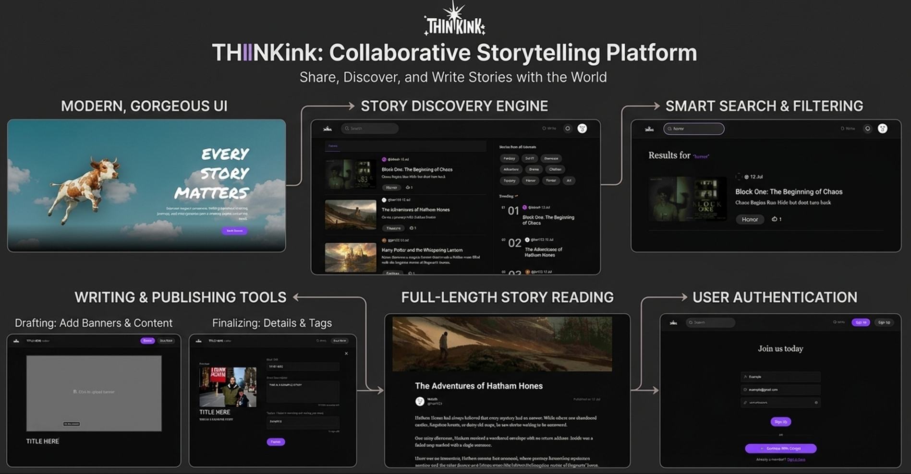

# ThinkInk ✨

ThinkInk is a modern storytelling platform inspired by Medium, built using the MERN stack. It provides a seamless experience for writers to create and publish stories while allowing readers to discover trending content across multiple genres.

Designed with a clean and responsive interface, ThinkInk combines a powerful writing experience with an engaging reading platform, making storytelling simple, interactive, and enjoyable.

## Preview

## 🚀 Features

- 🔐 Secure User Authentication
- ✍️ Rich Blog Editor powered by Editor.js
- 📝 Create, Edit, and Publish Stories
- 📖 Beautiful Story Reading Experience
- ❤️ Like Stories
- 🔥 Trending Blogs
- 🏷️ Category & Tag-Based Story Discovery
- 📱 Fully Responsive Design
- 🖼️ Custom Story Banner Support
- ⚡ Fast MERN Stack Architecture

## 🛠️ Tech Stack

### Frontend
- React.js
- Vite
- Tailwind CSS
- Editor.js
- Axios

### Backend
- Node.js
- Express.js
- MongoDB
- JWT Authentication

